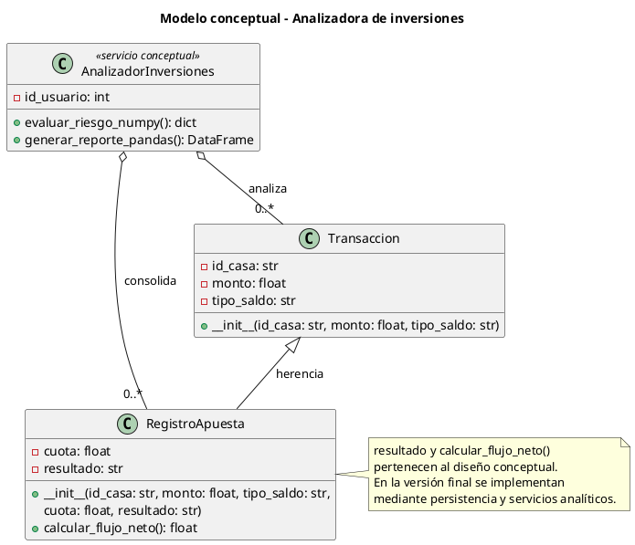
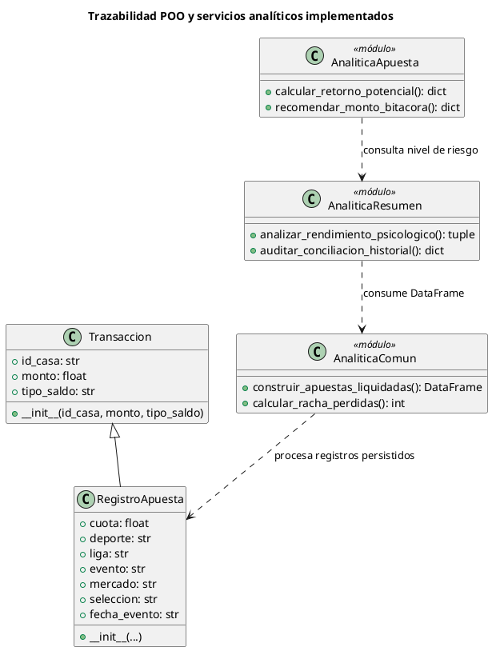
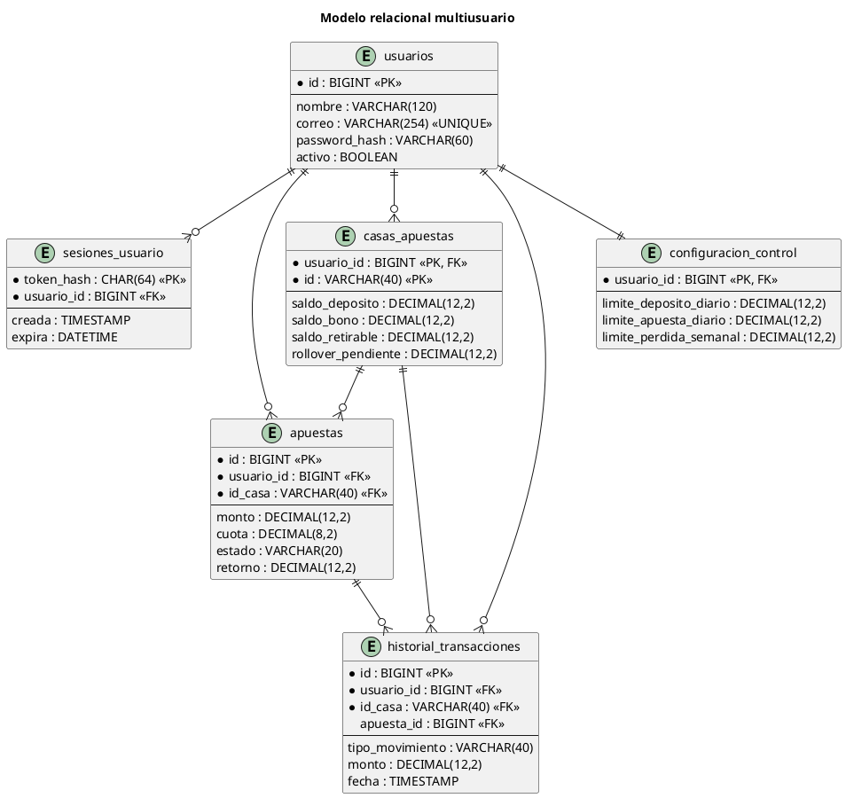

# DOCUMENTACIÓN TÉCNICA DEL PROYECTO FINAL

## Web App Analizadora de Inversiones y Control de Bonos en Casas de Apuestas con Sistema Automatizado de Alertas de Riesgo

**Curso:** Lenguajes de Programación  
**Institución:** Universidad Tecnológica del Perú — UTP  
**Ámbito académico:** Proyecto final de aplicación web multiparadigma  
**Tecnologías principales:** Python, Streamlit, Pandas, NumPy y MySQL Server  
**Casas contempladas inicialmente:** Betano, Inkabet y Te Apuesto  
**Ubicación de referencia:** Lima, Perú  

---

## Resumen ejecutivo

El proyecto consiste en una aplicación web de registro, auditoría y análisis de operaciones realizadas en casas de apuestas en línea. Su propósito no es pronosticar resultados deportivos ni garantizar ganancias. La solución funciona como una bitácora financiera personal que separa depósitos, bonos y saldos retirables; controla condiciones de rollover; registra apuestas pendientes o liquidadas; y transforma el historial del usuario en indicadores cuantitativos y mensajes preventivos de riesgo.

La aplicación utiliza Streamlit como interfaz web, Python como lenguaje de programación, Pandas y NumPy como herramientas de procesamiento analítico, y MySQL Server como sistema de gestión de base de datos relacional. La versión final incorpora autenticación con Bcrypt, persistencia de sesiones, transacciones con `commit` y `rollback`, y aislamiento multiusuario mediante claves foráneas y filtros explícitos por `usuario_id`.

El sistema se plantea académicamente como una Startup Fintech de asesoría informativa y auditoría de inversiones alternativas de alto riesgo. Esta denominación describe su orientación tecnológica y analítica; no implica que la aplicación administre dinero, ejecute apuestas por cuenta del usuario, otorgue créditos, capte fondos ni preste asesoría financiera regulada.

---

# PARTE 1: PRESENTACIÓN DEL PRIMER AVANCE DEL TRABAJO FINAL

## 1. Informe situacional de la solución

### 1.1 Alcance del negocio

La propuesta se formula como una Startup Fintech de Asesoría y Auditoría de Inversiones Alternativas de Alto Riesgo, orientada al consumidor de entretenimiento digital de Lima Metropolitana. Su producto central es una plataforma web que permite reconstruir y analizar la posición financiera real del usuario frente a distintas casas de apuestas.

El alcance funcional comprende:

1. Registro y autenticación individual de usuarios.
2. Configuración independiente de casas de apuestas.
3. Registro de depósitos, bonos, apuestas, cash out y retiros.
4. Separación contable entre saldo depositado, saldo de bono y saldo retirable.
5. Cálculo y seguimiento de rollover por casa.
6. Registro de apuestas pendientes y de su exposición potencial.
7. Cálculo de resultados, ROI, drawdown, tasa de acierto y concentración de capital.
8. Detección de patrones conductuales de riesgo.
9. Emisión automática de advertencias y recomendaciones conservadoras.
10. Aislamiento total de datos entre usuarios.

El producto no se conecta directamente con las plataformas de apuestas ni ejecuta operaciones monetarias. La información es ingresada por el propio usuario y se utiliza con fines de control, trazabilidad y educación financiera preventiva.

### 1.2 Ubicación e historia de la iniciativa

La iniciativa se sitúa teóricamente en Lima, Perú, como respuesta al crecimiento acelerado de las plataformas de apuestas y entretenimiento digital. La disponibilidad permanente de estas aplicaciones ha incrementado la frecuencia con la que los usuarios realizan depósitos, reciben promociones, aceptan bonos y ejecutan apuestas sin disponer necesariamente de un sistema independiente de control.

La idea de negocio surge al observar tres carencias:

- Los historiales proporcionados por las casas priorizan el detalle operativo, pero no siempre presentan una lectura consolidada del capital propio.
- Los bonos pueden incrementar el saldo visible sin representar dinero inmediatamente retirable.
- La evaluación intuitiva del usuario suele concentrarse en apuestas ganadas de manera aislada y no en el resultado neto total.

Frente a ello, la Startup propone una capa independiente de auditoría personal que centraliza información de Betano, Inkabet y Te Apuesto, manteniendo a la vez la posibilidad de agregar otras casas con sus propias condiciones.

### 1.3 Descripción de la operación

La operación del servicio se basa en un ciclo de auditoría continua:

1. El usuario crea una cuenta protegida mediante contraseña cifrada con Bcrypt.
2. La aplicación crea para ese usuario las casas predeterminadas y sus billeteras lógicas.
3. El usuario registra depósitos y bonos recibidos.
4. El sistema calcula el rollover generado de acuerdo con la regla particular de la casa.
5. El usuario registra apuestas indicando monto, cuota, origen del saldo y estado.
6. La aplicación concilia el capital utilizado con las billeteras registradas.
7. Las apuestas pendientes se mantienen como exposición sin considerarse todavía ganancia o pérdida realizada.
8. Al liquidar una apuesta, se actualizan saldos, retornos y rollover.
9. Pandas estructura el historial y NumPy calcula métricas vectorizadas.
10. El dashboard presenta resultados, alertas, exposición y disponibilidad de retiro.

La propuesta de valor consiste en mostrar la diferencia entre saldo visible, dinero propio, bono condicionado y capital realmente retirable.

## 2. Informe de la situación problemática

### 2.1 Opacidad transaccional

El usuario puede mantener actividad simultánea en varias plataformas. Cada una presenta sus movimientos con formatos, conceptos y reglas particulares. Como consecuencia, la persona no dispone de una visión consolidada de cuánto depositó, cuánto retiró, cuánto mantiene expuesto y cuál es su resultado neto real.

La fragmentación de la información produce una opacidad práctica: los datos existen, pero no se transforman automáticamente en una explicación financiera comprensible. El usuario debe reconstruir manualmente el historial, distinguir capital propio de fondos promocionales y comparar movimientos entre plataformas.

### 2.2 Congelamiento asimétrico por rollover

El rollover es una condición que obliga a apostar un volumen determinado antes de habilitar el retiro de ciertos fondos. Esta regla puede afectar depósitos, bonos o ambos, dependiendo de la casa.

El problema se vuelve asimétrico cuando:

- El usuario percibe el saldo como disponible, aunque esté condicionado.
- Una nueva recarga incrementa nuevamente el rollover pendiente.
- El bono eleva el saldo nominal, pero no necesariamente el dinero propio.
- La cuota de una apuesta puede no ser suficiente para liberar rollover.
- El usuario intenta recuperar pérdidas mediante nuevas exposiciones.

La solución separa el saldo de depósito, el bono y el saldo retirable; además, muestra el rollover generado, liberado y pendiente por casa.

### 2.3 Sesgo de ilusión de ganancia

El sesgo de ilusión de ganancia ocurre cuando el usuario interpreta una alta cantidad de aciertos como evidencia de rentabilidad. Es posible ganar varias apuestas pequeñas y perder una apuesta de mayor monto, obteniendo una tasa de acierto alta y, al mismo tiempo, un balance negativo.

Ejemplo conceptual:

- Ganancia 1: S/ 4.00.
- Ganancia 2: S/ 5.00.
- Ganancia 3: S/ 3.00.
- Pérdida posterior: S/ 30.00.
- Resultado neto: pérdida de S/ 18.00.

Aunque existan tres decisiones ganadoras y una perdedora, el capital se ha reducido. El sistema detecta este patrón comparando la tasa de acierto con el flujo efectivo acumulado.

### 2.4 Otros riesgos identificados

- Persecución de pérdidas mediante incremento del monto apostado.
- Rachas consecutivas de resultados negativos.
- Drawdown elevado respecto del capital expuesto.
- Concentración de la mayor parte del saldo en una sola casa.
- Bonos que camuflan un flujo de caja negativo.
- Apuestas registradas sin respaldo completo en las billeteras.
- Confusión entre retorno total y ganancia neta.
- Confusión entre saldo para jugar y saldo retirable.

## 3. Proceso a solucionar mediante automatización

### 3.1 Flujo automatizado

#### Etapa 1: recepción de datos

La capa de presentación muestra formularios Streamlit para registrar:

- Casa de apuestas.
- Monto depositado.
- Bono recibido.
- Monto apostado.
- Cuota decimal.
- Origen del saldo.
- Deporte, liga, evento y detalle.
- Fecha del evento.
- Resultado o estado pendiente.
- Monto de cash out.
- Retiro solicitado.

#### Etapa 2: parsing, normalización y conversión

Los valores ingresados se convierten a tipos concretos de Python:

- Identificadores y descripciones: `str`.
- Identificador de usuario y apuesta: `int`.
- Montos, cuotas, saldos y métricas: `float` durante el cálculo.
- Confirmaciones y estados de control: `bool`.

Los textos son limpiados con operaciones como eliminación de espacios, conversión a mayúsculas y separación por comas. Las fechas se normalizan al formato ISO `AAAA-MM-DD`.

#### Etapa 3: validación de la entidad

La información de una apuesta es convertida en un objeto `RegistroApuesta`. El constructor valida que el monto sea positivo, que exista una casa, que la cuota sea mayor que 1.00, que el tipo de saldo sea válido y que los campos deportivos estén completos.

#### Etapa 4: aplicación de reglas financieras

El backend ejecuta, entre otras, las siguientes reglas:

- El depósito aumenta la billetera de depósito.
- El bono aumenta exclusivamente la billetera promocional.
- Cada recarga genera rollover según los multiplicadores de la casa.
- Una apuesta pendiente reserva exposición, pero no se considera resultado realizado.
- Una apuesta perdida descuenta el capital conciliado.
- Una apuesta ganada acredita el retorno al saldo retirable.
- Cuando se apuesta con bono, solo la ganancia neta se transforma en retirable.
- Una apuesta anulada restituye el monto conciliado.
- El cash out registra exactamente el monto recibido.
- El retiro exige saldo suficiente, mínimo alcanzado y rollover igual a cero.

#### Etapa 5: persistencia transaccional

Las operaciones se ejecutan dentro de context managers de conexión. Si todas las instrucciones terminan correctamente, se confirma la transacción mediante `commit`. Si ocurre una excepción, se ejecuta `rollback`, evitando actualizaciones parciales de saldos e historial.

#### Etapa 6: construcción analítica

Las consultas MySQL se transforman en listas de diccionarios y posteriormente en DataFrames. Pandas limpia fechas, descarta registros incompletos, ordena cronológicamente y agrupa resultados por casa.

NumPy convierte las columnas numéricas en arreglos y calcula sumas, medias, mínimos, máximos, acumulados, máscaras booleanas, ROI, drawdown y concentración.

#### Etapa 7: activación de alertas

Los resultados estadísticos se contrastan con umbrales de riesgo. Cuando se cumple una condición, se agrega un mensaje estructurado con código, nivel y descripción. Streamlit representa las alertas como mensajes informativos, advertencias o errores según su severidad.

## 4. Descripción de componentes POO

### 4.1 Modelo conceptual del Primer Avance

El modelo conceptual solicitado considera tres clases principales.

#### Clase padre `Transaccion`

Representa una operación financiera genérica asociada a una casa.

| Elemento | Tipo | Finalidad |
|---|---|---|
| `id_casa` | `str` | Identifica la casa de apuestas. |
| `monto` | `float` | Representa el importe de la operación. |
| `tipo_saldo` | `str` | Indica depósito, bono o saldo retirable. |
| `__init__()` | Constructor | Normaliza atributos y valida el monto. |

#### Clase hija conceptual `RegistroApuesta`

Especializa una transacción para representar una apuesta.

| Elemento | Tipo | Finalidad |
|---|---|---|
| `cuota` | `float` | Cuota decimal de la apuesta. |
| `resultado` | `str` | Resultado conceptual: pendiente, ganada, perdida, anulada o cash out. |
| `calcular_flujo_neto()` | Método conceptual | Calcula ganancia neta o pérdida según monto, cuota y resultado. |

#### Servicio conceptual `AnalizadorInversiones`

| Elemento | Tipo | Finalidad |
|---|---|---|
| `id_usuario` | `int` | Delimita los datos que pueden ser analizados. |
| `evaluar_riesgo_numpy()` | Método conceptual | Ejecuta métricas vectorizadas y reglas de alerta. |
| `generar_reporte_pandas()` | Método conceptual | Construye el reporte tabular del usuario. |

### 4.2 Correspondencia exacta con la implementación final

La implementación final conserva la herencia, pero distribuye ciertas responsabilidades como servicios funcionales para respetar el MVC:

- `Transaccion` existe como clase padre con `id_casa`, `monto` y `tipo_saldo`.
- `RegistroApuesta` hereda de `Transaccion` y agrega `cuota`, `deporte`, `liga`, `evento`, `mercado`, `seleccion` y `fecha_evento`.
- El estado o resultado se persiste en la columna `estado` de la tabla `apuestas` y se procesa en los repositorios transaccionales.
- `calcular_flujo_neto()` no existe como método de la clase; su responsabilidad se implementa mediante funciones analíticas que calculan `Flujo_Efectivo`.
- `AnalizadorInversiones` no existe como clase física. Sus responsabilidades están separadas en los módulos `analitica_comun`, `analitica_resumen`, `analitica_apuesta`, `analitica_recarga` y `analitica_pendientes`.

Esta decisión mantiene la evidencia de POO e herencia y, al mismo tiempo, evita concentrar toda la analítica en una clase de gran tamaño.

## 5. Modelamiento UML

### 5.1 UML conceptual del Primer Avance



### 5.2 UML de trazabilidad de la implementación final



---

# PARTE 2: PRESENTACIÓN DEL SEGUNDO AVANCE DEL TRABAJO FINAL

## 1. Modelo de base de datos relacional

### 1.1 Enfoque general

La solución utiliza una única base MySQL multiusuario. Todas las entidades financieras incorporan `usuario_id`, lo que permite relacionarlas con la cuenta propietaria y aplicar filtros explícitos en cada consulta.

El modelo evita que dos usuarios compartan accidentalmente configuraciones, saldos o movimientos. Una casa se identifica mediante la clave compuesta `(usuario_id, id)`, por lo que dos usuarios pueden tener una casa denominada `BETANO` sin colisión.

Aunque el enunciado académico propone `DECIMAL(10,2)` como referencia, el esquema final emplea `DECIMAL(12,2)` para los importes monetarios. Esta decisión conserva dos decimales, amplía el rango admitido y mantiene plena compatibilidad con MySQL Server; no reduce ni altera la precisión exigida.

### 1.2 Entidades del esquema final

#### `usuarios`

Almacena identidad, correo único, hash Bcrypt y estado de la cuenta. Es la entidad principal de propiedad.

#### `sesiones_usuario`

Almacena exclusivamente el hash SHA-256 de cada token de sesión, su fecha de creación y expiración. La eliminación del usuario elimina sus sesiones mediante `ON DELETE CASCADE`.

#### `casas_apuestas`

Conserva las reglas y billeteras independientes de cada usuario:

- Saldo de depósito.
- Saldo de bono.
- Saldo retirable.
- Rollover pendiente.
- Retiro mínimo.
- Multiplicador de rollover de depósito.
- Multiplicador de rollover de bono.
- Cuota mínima válida.
- Deportes disponibles.

Su clave primaria compuesta es `(usuario_id, id)`.

#### `apuestas`

Registra la información deportiva y financiera de cada apuesta. Se relaciona con la casa mediante `(usuario_id, id_casa)`. Contiene monto, cuota, tipo de saldo, estado, retorno, capital conciliado, rollover liberado y fechas de registro y resolución.

#### `historial_transacciones`

Funciona como bitácora auditable. Registra recargas, bonos, retiros, apuestas pendientes y liquidaciones. Cada movimiento se relaciona con el usuario, con una casa y, cuando corresponde, con una apuesta.

#### `configuracion_control`

Mantiene límites personales por usuario: depósito diario, apuesta diaria, apuesta individual, pérdida semanal, pausa y modo estricto.

### 1.3 Relación central solicitada

Las dos tablas financieras centrales son `casas_apuestas` e `historial_transacciones`:

- Una casa pertenece a un usuario.
- Una casa puede tener muchos movimientos.
- Un movimiento pertenece exactamente a un usuario y una casa.
- La FK compuesta impide asociar un movimiento con una casa de otro usuario.
- Si se elimina un usuario, sus casas desaparecen en cascada.
- Si una apuesta es eliminada, sus movimientos asociados se eliminan en cascada.

### 1.4 Modelo entidad-relación



## 2. Base de datos en MySQL

El siguiente script corresponde al esquema relacional de la aplicación final. Se utiliza `DECIMAL` para evitar errores de representación binaria en importes financieros, `InnoDB` para soportar transacciones y llaves foráneas, y `ON DELETE CASCADE` cuando la dependencia debe desaparecer con su propietario.

```sql
CREATE DATABASE IF NOT EXISTS apuestas_analitica_multiusuario
  CHARACTER SET utf8mb4 COLLATE utf8mb4_unicode_ci;
USE apuestas_analitica_multiusuario;

-- Identidad y autenticación principal.
CREATE TABLE IF NOT EXISTS usuarios (
  id BIGINT AUTO_INCREMENT PRIMARY KEY,
  nombre VARCHAR(120) NOT NULL,
  correo VARCHAR(254) NOT NULL UNIQUE,
  password_hash VARCHAR(60) NOT NULL,
  fecha_registro TIMESTAMP NOT NULL DEFAULT CURRENT_TIMESTAMP,
  activo BOOLEAN NOT NULL DEFAULT TRUE
) ENGINE=InnoDB;

-- Sesiones persistentes; nunca almacena el token original.
CREATE TABLE IF NOT EXISTS sesiones_usuario (
  token_hash CHAR(64) PRIMARY KEY,
  usuario_id BIGINT NOT NULL,
  creada TIMESTAMP NOT NULL DEFAULT CURRENT_TIMESTAMP,
  expira DATETIME NOT NULL,
  CONSTRAINT fk_sesion_usuario FOREIGN KEY (usuario_id)
    REFERENCES usuarios(id) ON DELETE CASCADE,
  INDEX idx_sesion_usuario (usuario_id)
) ENGINE=InnoDB;

-- Billeteras y reglas independientes por usuario y casa.
CREATE TABLE IF NOT EXISTS casas_apuestas (
  usuario_id BIGINT NOT NULL,
  id VARCHAR(40) NOT NULL,
  nombre_casa VARCHAR(120) NOT NULL,
  saldo_deposito DECIMAL(12,2) NOT NULL DEFAULT 0,
  saldo_bono DECIMAL(12,2) NOT NULL DEFAULT 0,
  saldo_retirable DECIMAL(12,2) NOT NULL DEFAULT 0,
  rollover_pendiente DECIMAL(12,2) NOT NULL DEFAULT 0,
  minimo_retiro DECIMAL(12,2) NOT NULL DEFAULT 50,
  rollover_deposito DECIMAL(8,2) NOT NULL DEFAULT 1,
  rollover_bono DECIMAL(8,2) NOT NULL DEFAULT 1,
  cuota_minima_rollover DECIMAL(8,2) NOT NULL DEFAULT 1.01,
  deportes VARCHAR(500) NOT NULL DEFAULT 'Futbol,Baloncesto,Tenis',
  PRIMARY KEY (usuario_id, id),
  CONSTRAINT fk_casa_usuario FOREIGN KEY (usuario_id)
    REFERENCES usuarios(id) ON DELETE CASCADE
) ENGINE=InnoDB;

-- Operaciones deportivas y conciliación de capital.
CREATE TABLE IF NOT EXISTS apuestas (
  id BIGINT AUTO_INCREMENT PRIMARY KEY,
  usuario_id BIGINT NOT NULL,
  id_casa VARCHAR(40) NOT NULL,
  deporte VARCHAR(80) NOT NULL,
  liga VARCHAR(120) NOT NULL,
  evento VARCHAR(255) NOT NULL,
  mercado VARCHAR(120) NOT NULL,
  seleccion VARCHAR(255) NOT NULL,
  fecha_evento DATE NOT NULL,
  monto DECIMAL(12,2) NOT NULL CHECK (monto > 0),
  cuota DECIMAL(8,2) NOT NULL CHECK (cuota > 1),
  tipo_saldo VARCHAR(20) NOT NULL,
  estado VARCHAR(20) NOT NULL DEFAULT 'PENDIENTE',
  retorno DECIMAL(12,2) NOT NULL DEFAULT 0,
  monto_conciliado DECIMAL(12,2) NOT NULL DEFAULT 0,
  rollover_liberado DECIMAL(12,2) NOT NULL DEFAULT 0,
  fecha_registro TIMESTAMP NOT NULL DEFAULT CURRENT_TIMESTAMP,
  fecha_resolucion TIMESTAMP NULL,
  UNIQUE KEY uq_apuesta_usuario_id (usuario_id, id),
  CONSTRAINT fk_apuesta_usuario FOREIGN KEY (usuario_id)
    REFERENCES usuarios(id) ON DELETE CASCADE,
  CONSTRAINT fk_apuesta_casa FOREIGN KEY (usuario_id, id_casa)
    REFERENCES casas_apuestas(usuario_id, id)
) ENGINE=InnoDB;

-- Libro de auditoría de movimientos financieros.
CREATE TABLE IF NOT EXISTS historial_transacciones (
  id BIGINT AUTO_INCREMENT PRIMARY KEY,
  usuario_id BIGINT NOT NULL,
  id_casa VARCHAR(40) NOT NULL,
  apuesta_id BIGINT NULL,
  tipo_movimiento VARCHAR(40) NOT NULL,
  monto DECIMAL(12,2) NOT NULL,
  cuota DECIMAL(8,2) NOT NULL DEFAULT 1,
  tipo_saldo_usado VARCHAR(20) NOT NULL,
  fecha TIMESTAMP NOT NULL DEFAULT CURRENT_TIMESTAMP,
  CONSTRAINT fk_historial_usuario FOREIGN KEY (usuario_id)
    REFERENCES usuarios(id) ON DELETE CASCADE,
  CONSTRAINT fk_historial_casa FOREIGN KEY (usuario_id, id_casa)
    REFERENCES casas_apuestas(usuario_id, id),
  CONSTRAINT fk_historial_apuesta FOREIGN KEY (usuario_id, apuesta_id)
    REFERENCES apuestas(usuario_id, id) ON DELETE CASCADE,
  INDEX idx_historial_usuario_fecha (usuario_id, fecha)
) ENGINE=InnoDB;

-- Parámetros preventivos personalizados.
CREATE TABLE IF NOT EXISTS configuracion_control (
  usuario_id BIGINT PRIMARY KEY,
  limite_deposito_diario DECIMAL(12,2) NOT NULL DEFAULT 100,
  limite_apuesta_diario DECIMAL(12,2) NOT NULL DEFAULT 100,
  limite_apuesta_individual DECIMAL(12,2) NOT NULL DEFAULT 20,
  limite_perdida_semanal DECIMAL(12,2) NOT NULL DEFAULT 150,
  pausa_hasta DATETIME NULL,
  modo_estricto BOOLEAN NOT NULL DEFAULT TRUE,
  CONSTRAINT fk_configuracion_usuario FOREIGN KEY (usuario_id)
    REFERENCES usuarios(id) ON DELETE CASCADE
) ENGINE=InnoDB;
```

## 3. Arquitectura de desarrollo de la solución

### 3.1 Vista lógica de tres capas

#### Capa de presentación

Implementada con Streamlit y ubicada en `views/` y `app.py`. Sus responsabilidades son:

- Mostrar formularios y controles.
- Recibir información del usuario.
- Mostrar métricas, tablas, gráficos y alertas.
- Administrar la navegación y el estado visual.
- Solicitar casos de uso a Controllers.

La capa visual no contiene SQL. La validación de dominio de la apuesta se solicita mediante el controlador transaccional.

#### Capa de lógica de negocio y analítica

Ubicada en `controllers/` y complementada por entidades de dominio. Incluye:

- Autenticación y validación de credenciales.
- Coordinación del registro de apuestas.
- Cálculo de retorno potencial.
- Cálculo de rollover estimado.
- Análisis de resultados.
- Recomendaciones conservadoras.
- Detección de patrones de riesgo.
- Construcción de resúmenes para el dashboard.

Pandas estructura la información; NumPy ejecuta cálculos vectorizados; y las entidades POO normalizan los datos antes de persistirlos.

#### Capa de persistencia

Ubicada en `models/` y `models/repositorios/`. Sus responsabilidades son:

- Crear conexiones y pools MySQL.
- Leer configuración desde `.env`.
- Crear el esquema relacional.
- Ejecutar consultas parametrizadas.
- Aplicar filtros explícitos por usuario.
- Confirmar o revertir transacciones.
- Mantener la integridad referencial.

### 3.2 Arquitectura física

```text
bets_analitica/
├── app.py
├── requirements.txt
├── .env.example
├── controllers/
│   ├── autenticacion.py
│   ├── transacciones.py
│   ├── analitica_comun.py
│   ├── analitica_resumen.py
│   ├── analitica_apuesta.py
│   ├── analitica_recarga.py
│   └── analitica_pendientes.py
├── models/
│   ├── entidades.py
│   ├── conexion_mysql.py
│   ├── mysql_adapter.py
│   ├── database.py
│   ├── usuarios.py
│   ├── schema_mysql.sql
│   └── repositorios/
│       ├── conexion.py
│       ├── casas.py
│       ├── apuestas.py
│       ├── movimientos.py
│       ├── historial.py
│       └── configuracion.py
├── views/
│   ├── autenticacion.py
│   ├── componentes.py
│   ├── apuesta/
│   ├── casas/
│   ├── historial/
│   ├── pendientes/
│   ├── recarga/
│   ├── resumen/
│   └── retiro/
└── test_sistema.py
```

### 3.3 Flujo de datos

```text
Usuario
  ↓
Widget o formulario Streamlit
  ↓
Vista especializada
  ↓
Controller / caso de uso
  ↓
Entidad POO y validaciones
  ↓
Repositorio de dominio
  ↓
Transacción MySQL filtrada por usuario_id
  ↓
Consulta de resultados
  ↓
DataFrame Pandas y arreglos NumPy
  ↓
Métricas y reglas de alerta
  ↓
Dashboard privado del usuario
```

### 3.4 Seguridad y aislamiento

- La contraseña se protege con Bcrypt y salt aleatorio.
- Las credenciales MySQL se cargan desde `.env`, archivo excluido del repositorio.
- Las consultas utilizan parámetros; los valores del usuario no se concatenan al SQL.
- Cada consulta financiera incluye `usuario_id`.
- Las FK compuestas impiden asociar datos con una casa ajena.
- Las sesiones almacenan el hash del token y poseen expiración.
- La aplicación exige un contexto autenticado antes de acceder a repositorios financieros.

---

# PARTE 3: PRESENTACIÓN FINAL — CUMPLIMIENTO DEL SÍLABO

## 1. Requerimientos estructurales y estructura del proyecto

La primera propuesta académica hacía referencia a archivos raíz denominados `database.py`, `modelos.py` y `analitica.py`. Durante la refactorización final estas fachadas fueron eliminadas para evitar duplicación y dependencias ambiguas.

La correspondencia actual es:

| Referencia inicial | Implementación final |
|---|---|
| `app.py` | Se conserva como punto de entrada y composición. |
| `database.py` | `models/database.py` y repositorios especializados. |
| `modelos.py` | `models/entidades.py`. |
| `analitica.py` | Módulos especializados `controllers/analitica_*.py`. |

Esta organización mejora escalabilidad, mantenibilidad y trazabilidad. Cada archivo posee una responsabilidad identificable y las importaciones son explícitas, sin utilizar `import *`.

## 2. Paradigmas y fundamentos

### 2.1 Enfoque multiparadigma

#### Programación estructurada

Se manifiesta en el flujo secuencial de la aplicación, las validaciones, la navegación, las estructuras condicionales y los bucles. La función de normalización textual incluye un `while` finito y verificable.

#### Programación funcional

La analítica se divide en funciones con entradas y salidas definidas. Varias funciones transforman datos sin depender de elementos visuales; por ejemplo, el cálculo de retorno potencial, el resumen de pendientes y la construcción de alertas.

#### Programación orientada a objetos

Las entidades `Transaccion` y `RegistroApuesta` representan operaciones mediante atributos, constructores, herencia y reutilización de validaciones. El adaptador MySQL también emplea clases para encapsular conexiones, cursores y filas.

### 2.2 Tipos de datos

| Tipo | Aplicación |
|---|---|
| `int` | IDs, cantidad de apuestas, rachas, índices y puntos de riesgo. |
| `float` | Montos, cuotas, ROI, porcentajes y métricas analíticas. |
| `str` | Correos, nombres, casas, estados, deportes y mensajes. |
| `bool` | Confirmaciones, suficiencia de saldo, bloqueo y estado activo. |
| `date/datetime` | Fecha del evento, registro, resolución y expiración. |

### 2.3 Operadores

Los operadores aritméticos se emplean en:

- Retorno total: monto por cuota.
- Ganancia neta: monto por cuota menos uno.
- Pérdida: monto negativo.
- Rollover: monto por multiplicador.
- ROI: resultado dividido entre total apostado.
- Drawdown: máximo histórico menos balance acumulado.
- Concentración: capital de la casa dividido entre capital total.

Los operadores relacionales verifican montos positivos, cuotas mayores que uno, límites y saldos. Los operadores lógicos combinan condiciones de riesgo, estados, disponibilidad de retiro y pertenencia a conjuntos válidos.

### 2.4 Condicionales

Las estructuras `if`, `elif` y `else` permiten decidir:

- Si una apuesta es ganada, perdida, anulada, pendiente o cash out.
- Qué billetera debe ser afectada.
- Si existe saldo suficiente.
- Si una casa puede eliminarse.
- Si un retiro cumple las reglas.
- Qué nivel de alerta debe mostrarse.
- Si corresponde recomendar una pausa.

## 3. Estructuras de datos y modularidad

### 3.1 Cadenas

Las cadenas representan identificadores, textos deportivos, estados y mensajes. Se aplican `strip`, `upper`, `lower`, `split`, `join`, `replace`, codificación UTF-8, expresiones regulares y f-strings.

### 3.2 Listas

Las listas almacenan casas, apuestas, movimientos, alertas, columnas, descuentos y recomendaciones. Las comprensiones permiten filtrar movimientos o construir arreglos antes del análisis.

### 3.3 Tuplas

Las tuplas representan conjuntos inmutables de estados y parámetros SQL. Su uso es conveniente cuando los valores no deben alterarse durante una operación.

### 3.4 Diccionarios

Los diccionarios constituyen el formato intermedio principal entre persistencia, negocio y presentación. Permiten acceder a datos mediante nombres de campo y construir respuestas estructuradas con métricas, alertas y diagnósticos.

### 3.5 Modularidad

El sistema utiliza paquetes, módulos e importaciones explícitas. La modularidad permite modificar una vista, una regla analítica o un repositorio sin reescribir la aplicación completa.

## 4. Programación orientada a objetos

### 4.1 Constructor y `self`

El constructor de `Transaccion` inicializa los atributos comunes. `self` representa la instancia concreta y permite que cada objeto conserve su propia casa, monto y tipo de saldo.

### 4.2 Herencia

`RegistroApuesta` hereda de `Transaccion`. Mediante `super().__init__()` reutiliza la inicialización y validación de los atributos comunes. Después agrega los datos específicos de una apuesta.

Esta relación evita duplicar:

- Normalización del código de casa.
- Conversión del monto.
- Normalización del tipo de saldo.
- Validación de obligatoriedad y monto positivo.

### 4.3 Objetos

Cuando el usuario envía el formulario de apuesta, el controlador instancia `RegistroApuesta`. Si la entidad no cumple sus invariantes, se genera una excepción controlada y no se persiste información inválida.

## 5. Ciencia de datos y sistema de alertas

### 5.1 Uso de Pandas

Pandas se utiliza para:

1. Crear DataFrames desde listas de diccionarios.
2. Convertir fechas MySQL a valores temporales.
3. Eliminar registros con datos esenciales inválidos.
4. Ordenar cronológicamente.
5. Restablecer índices.
6. Crear columnas derivadas.
7. Agrupar resultados por casa.
8. Calcular sumas, conteos y promedios agregados.
9. Preparar tablas para Streamlit.

### 5.2 Uso de NumPy

NumPy se utiliza realmente, no solo como dependencia. Entre las operaciones aplicadas se encuentran:

- `np.array`: construcción de vectores numéricos.
- `np.sum`: total apostado, depositado, retirado y resultados.
- `np.mean`: ticket promedio.
- `np.min` y `np.max`: mejores y peores resultados.
- `np.cumsum`: balance acumulado.
- `np.maximum.accumulate`: máximos históricos.
- `np.where`: retornos porcentuales y ROI por casa.
- `np.roll`: comparación con la apuesta anterior.
- `np.logical_and`: detección vectorizada de persecución de pérdidas.
- `np.argmax`: identificación de la casa con mayor concentración.

### 5.3 Alertas automáticas

#### Ilusión de ganancia

Se activa cuando la tasa de acierto es alta y el resultado neto de apuestas es negativo. El sistema advierte que múltiples aciertos no equivalen necesariamente a rentabilidad.

#### Drawdown y descapitalización

El balance acumulado se compara con sus máximos históricos. Una caída elevada indica deterioro del capital y genera una alerta de nivel alto.

#### Persecución de pérdidas

Se compara cada monto con el inmediatamente anterior. Si una pérdida previa es seguida por un incremento superior al umbral configurado, se contabiliza un patrón de persecución.

#### Racha de pérdidas

El sistema recorre los resultados recientes en orden inverso y cuenta pérdidas consecutivas. Una racha de tres o más activa una advertencia.

#### Bono que camufla pérdida

Se activa cuando existen bonos visibles, el flujo de caja es negativo y los retiros no recuperan los depósitos realizados.

#### Concentración

Se calcula la proporción de capital que permanece en cada casa. Si una sola concentra al menos el umbral definido, se advierte falta de diversificación.

#### Rollover pendiente

Si una casa mantiene rollover, el sistema presenta el capital como condicionado y bloquea conceptualmente su interpretación como dinero libre. El retiro operativo exige rollover igual a cero.

#### Falta de conciliación

La auditoría compara el monto de cada apuesta liquidada con el capital efectivamente descontado de las billeteras. Las diferencias se informan para evitar que el dashboard presente saldos como plenamente confiables.

### 5.4 Presentación de mensajes

Cada alerta se estructura con:

- Código identificador.
- Nivel de severidad.
- Mensaje explicativo.

Streamlit presenta niveles altos como errores visuales y niveles medios como advertencias. Las alertas son informativas y preventivas; no constituyen una predicción deportiva.

## 6. Persistencia y transaccionalidad

### 6.1 Integración con MySQL

La aplicación emplea `mysql-connector-python` y un pool reutilizable de conexiones. El nombre de la base se valida antes de utilizarse y las credenciales se obtienen desde variables cargadas por `python-dotenv`.

### 6.2 Consultas parametrizadas

Los valores proporcionados por el usuario se envían como parámetros, reduciendo el riesgo de inyección SQL. Las interpolaciones dinámicas se limitan a identificadores internos previamente controlados.

### 6.3 `commit` y `rollback`

Cada operación se ejecuta dentro de un contexto transaccional:

- `commit` confirma todos los cambios cuando no existe error.
- `rollback` revierte toda la operación cuando ocurre una excepción.
- `close` devuelve la conexión al pool.

Este mecanismo es fundamental porque una apuesta puede requerir varias acciones: insertar la apuesta, descontar saldo, liberar rollover y registrar historial. Si una falla, ninguna debe quedar confirmada parcialmente.

### 6.4 Integridad multiusuario

La seguridad no depende únicamente de la interfaz. Cada repositorio obtiene el usuario autenticado y filtra todas sus operaciones mediante `usuario_id`. Además, MySQL impone relaciones que impiden asociar apuestas o movimientos con casas pertenecientes a otra cuenta.

## 7. Matriz consolidada de cumplimiento del sílabo

| Contenido | Evidencia en el proyecto | Cumplimiento |
|---|---|---:|
| Estructuras secuenciales | Flujo de inicio, autenticación y navegación | Sí |
| Tipos de datos | Conversión explícita de IDs, montos, textos y booleanos | Sí |
| Entrada y salida | Formularios, widgets, métricas, tablas y mensajes Streamlit | Sí |
| Cadenas | Normalización, separación, unión y validación | Sí |
| Condicionales | Reglas de saldos, resultados, retiros y alertas | Sí |
| Bucles | Recorrido de casas, movimientos, apuestas y un `while` finito | Sí |
| Listas | Alertas, apuestas, movimientos y recomendaciones | Sí |
| Tuplas | Parámetros SQL y conjuntos inmutables | Sí |
| Diccionarios | Entidades recuperadas y métricas estructuradas | Sí |
| Funciones | Casos de uso, transformaciones y validaciones | Sí |
| Modularidad | Packages Models, Controllers y Views | Sí |
| Clases y objetos | Entidades y adaptador MySQL | Sí |
| Constructores y `self` | Inicialización de entidades y conexiones | Sí |
| Herencia | `RegistroApuesta` hereda de `Transaccion` | Sí |
| Pandas y NumPy | DataFrames, agrupaciones y vectores estadísticos | Sí |
| Base de datos relacional | MySQL, PK, FK, índices y DECIMAL | Sí |
| Seguridad | Bcrypt, `.env`, tokens con hash y aislamiento por usuario | Sí |
| Transacciones | `commit`, `rollback` y context managers | Sí |

---

# CONCLUSIONES

1. La solución automatiza un proceso que normalmente depende de cálculos manuales y de información fragmentada entre distintas plataformas.
2. La separación de billeteras evita presentar bonos o depósitos condicionados como dinero inmediatamente retirable.
3. El sistema de alertas transforma datos históricos en mensajes preventivos comprensibles.
4. El enfoque multiparadigma demuestra programación estructurada, funcional y orientada a objetos.
5. La herencia reduce duplicación al modelar atributos comunes de las transacciones.
6. Pandas y NumPy se utilizan en operaciones analíticas reales y verificables.
7. MySQL proporciona persistencia, transaccionalidad e integridad referencial.
8. La multitenencia relacional garantiza independencia de casas, saldos, movimientos y dashboards.
9. La arquitectura MVC facilita mantenimiento y sustentación técnica.
10. El proyecto cumple el objetivo académico sin afirmar que predice eventos o garantiza ganancias.

# RECOMENDACIONES

1. Rotar cualquier contraseña MySQL que haya sido compartida antes de la incorporación de `.env`.
2. Mantener `.env` fuera del control de versiones y distribuir únicamente `.env.example`.
3. Ejecutar las pruebas con una base exclusiva definida por `MYSQL_TEST_DATABASE`.
4. Mantener los importes financieros en `DECIMAL` dentro de MySQL.
5. Migrar los tokens persistentes a cookies seguras antes de un despliegue productivo público.
6. Implementar respaldos periódicos y políticas de retención.
7. Agregar trazabilidad administrativa y bitácora de accesos si el sistema escala.
8. Mantener el mensaje de uso responsable y evitar presentar recomendaciones como predicciones.
9. Validar con asesoría legal cualquier eventual explotación comercial vinculada a servicios financieros o juegos en línea.
10. Conservar la correspondencia entre `schema_mysql.sql` y el esquema creado por la aplicación.

---

## Declaración final de alcance

La Web App Analizadora de Inversiones y Control de Bonos es una herramienta académica de registro, auditoría y análisis descriptivo. Sus resultados dependen de la exactitud de la información ingresada. La aplicación no garantiza rentabilidad, no reemplaza asesoría profesional, no administra fondos y no pronostica resultados deportivos.
